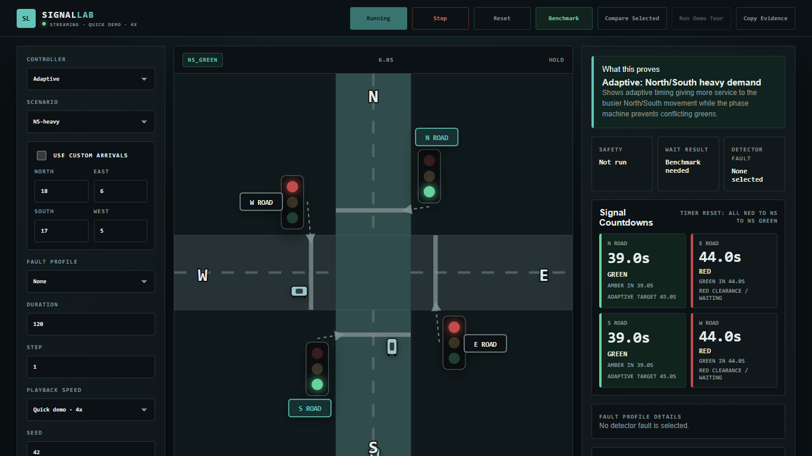
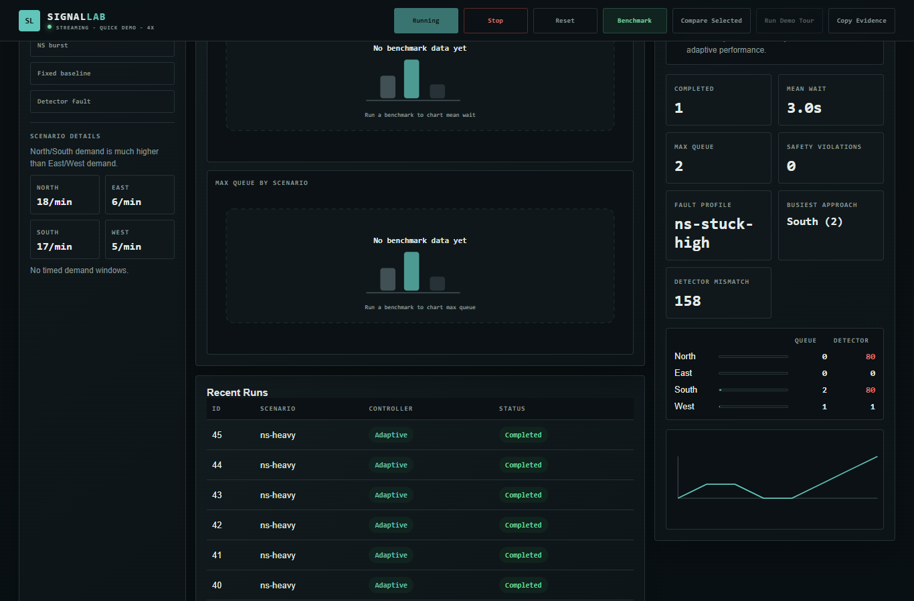
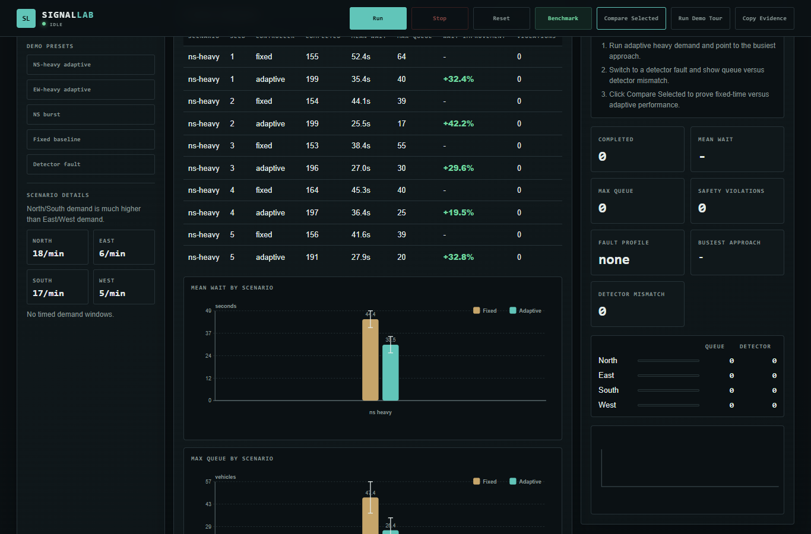

# Presentation Ready Folder

Use this folder for the project defence or viva.

## Open First

1. `00-complete-prep-guide.md`
2. `01-presentation-deck.pptx`
3. `02-final-report-gctu-structure.pdf`
4. `02-final-report-gctu-structure.docx`
5. `03-demonstration-script.md`
6. `10-simulation-run-manual.md`

## Supporting Files

- `04-demo-rehearsal-result.md`: confirms the dashboard, fault run, and benchmark run worked.
- `05-final-submission-checklist.md`: final checks before submission.
- `06-institution-format-reference.md`: notes taken from the previous project format.
- `07-final-details-needed.md`: exact personal/institution details still needing confirmation.
- `08-defence-qa-cheat-sheet.md`: short answers for likely examiner questions.
- `09-methodology-implementation.md`: methodology and implementation chapter draft.
- `10-simulation-run-manual.md`: practical run manual for starting and demonstrating the dashboard.
- `02-final-report-gctu-structure.md`: editable Markdown source for the report.
- `screenshots/`: fallback dashboard screenshots.
- `evidence/`: CSV summaries, SVG charts, and final result summary.

## Final Screenshot Evidence

These screenshots were refreshed from the local dashboard on 15 September 2026.

| Screenshot | Shows |
|---|---|
|  | Adaptive live run with vehicles, road labels, signal countdowns, and queue telemetry |
|  | Fault profile evidence showing true queue values separated from faulty detector demand |
|  | Fixed-vs-adaptive comparison rows and aggregate charts |

## Live Demo Command

```powershell
.\.venv\Scripts\python.exe -m uvicorn trafficlight.api.app:app --host 127.0.0.1 --port 8000
```

Open `http://127.0.0.1:8000/?v=countdowns-live`.
